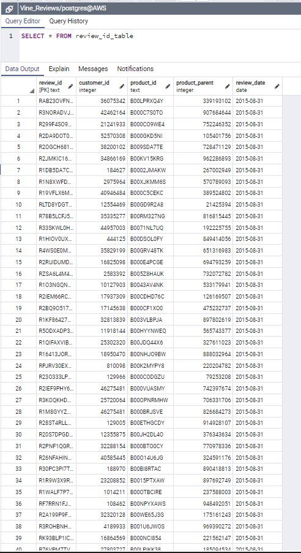

# Amazon Vine Analysis 

## Overview of the analysis

The purpose of this analysis is to analyze Amazon reviews written by members of the paid Amazon Vine program. The Amazon Vine program is a service that allows manufacturers and publishers to receive reviews for their products. Companies like SellBy pay a small fee to Amazon and provide products to Amazon Vine members, who are then required to publish a review. Analysis is conducted to determine whether there is any bias in the reviews of the Vine program, compared to unpaid customer reviews.

## Results 

### 1. How many Vine reviews and non-Vine reviews were there? 
    - There are only 82 total Vine reviews 
    - There are only 24,742 non-Vine reviews.

### 2. How many Vine reviews were 5 stars? How many non-Vine reviews were 5 stars? 
    - There are only 33 five star Vine reviews. 
    - There are 12,807 five star non-Vine reviews. 

### 3. What percentage of Vine reviews were 5 stars? What percentage of non-Vine reviews were 5 stars? 
    - 40.2% of Vine reviews were five stars. 
    - 51.8% of non-Vine reviews were five stars. 

## Summary 

In conclusion there is a negative bias for the Vine reviews with only 33 out of 82 reviews were five stars. There were 24,742 non-Vine reviews, with 51.8% of those reviews were five stars. Based on our analysis, non-Vine customers have no outside influence on their opinions and give more accurate reviews. In order to support this conclusion we can take a look at the lower star reviews for Vine and non-Vine reviews. 

## Storage in AWS server 

Below are screenshots of the dataset stored in AWS server on pgAdmin. 

